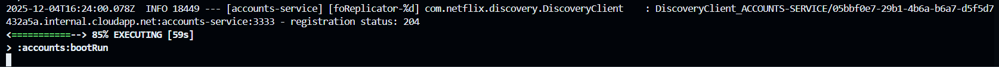
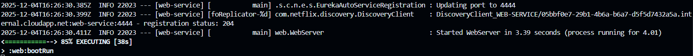
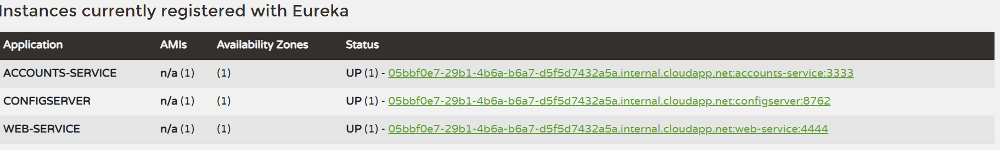
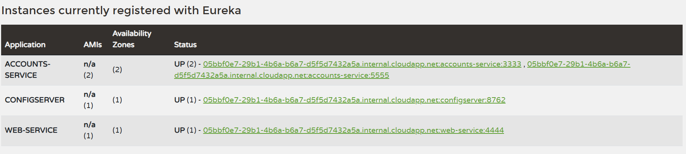
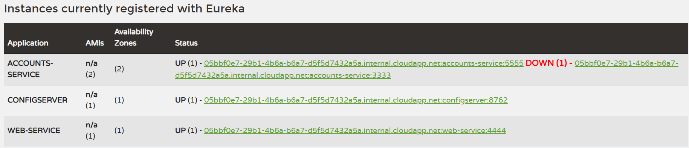
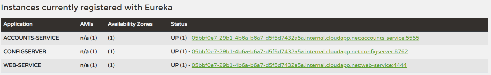
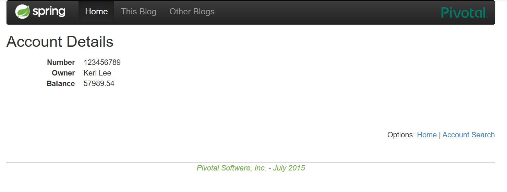

# Lab 6 Microservices - Project Report

## 1. Configuration Setup

**Configuration Repository**: [Link to your forked repository]

Describe the changes you made to the configuration:

- What did you modify in `accounts-service.yml`?
- Why is externalized configuration useful in microservices?

---

## 2. Service Registration (Task 1)
### Accounts Service Registration

When the microservice starts:

- It loads the Eureka client configuration, where the service name, network address, port, and other relevant parameters are defined.
- It establishes a connection with the Eureka Server.
- It sends an initial registration request that includes the service’s status, metadata, and the URL where it can be reached.
- Once Eureka validates and accepts the registration, it marks the service as UP, indicating that it is operational and available to be discovered by other microservices in the system.

### Web Service Registration

When the web service needs to communicate with the Accounts service, it requests from the Eureka Server the list of instances registered under that identifier (ACCOUNTS-SERVICE). Eureka returns the list of registered instances. The client then selects an available instance and sends its HTTP requests directly to that Accounts service instance.

---

## 3. Eureka Dashboard (Task 2)

Describe what the Eureka dashboard shows:

The registered services are ACCOUNTS-SERVICE and WEB-SERVICE. The information displayed for these instances includes:
- Service Name
- Status (indicates whether the instance is available or in another state)
- IP Address
- Port
- Availability Zone
- AMIs (not used)

---

## 4. Multiple Instances (Task 4)

Answer the following questions:

- What happens when you start a second instance of the accounts service?
When a second instance is started, Eureka detects it and registers it alongside the first instance. Therefore, when a client wants to use this service, Eureka returns the list of both instances.
- How does Eureka handle multiple instances?
Eureka maintains a record of all active instances. As explained earlier, if a client requests information about a service, Eureka provides the complete list of instances registered under that service name.
- How does client-side load balancing work with multiple instances?
When the client receives the list of instances, it distributes requests among the available instances to achieve load balancing and improve system resilience. 

---

## 5. Service Failure Analysis (Task 5)

### Initial Failure

When the Accounts service instance on port 3333 is stopped, any request sent to the Web service that tries to communicate with that instance will initially fail, since the instance is no longer available. Requests directed to the other instance (e.g., the one running on port 2222) will continue to function normally.

### Eureka Instance Removal

Explain how Eureka detects and removes the failed instance:

- How long did it take for Eureka to remove the dead instance? ? It took 1 second, this is because of the following line: eviction-interval-timer-in-ms: 1000.
- What mechanism does Eureka use to detect failures?
Periodic heartbeats sent by each instance. If the server does not receive a heartbeat within the expected time, it considers the instance failed and removes it from the registry.

---

## 6. Service Recovery Analysis (Task 6)

Answer the following questions:

- Why does the web service eventually recover?
- How long did recovery take?
- What role does client-side caching play in the recovery process?

---

## 7. Conclusions

Summarize what you learned about:

- Microservices architecture
- Service discovery with Eureka
- System resilience and self-healing
- Challenges you encountered and how you solved them

---

## 8. AI Disclosure

ChatGPT was used to correct grammatically error of this report. Approximately 10% of the report text was generated with AI assistance.

